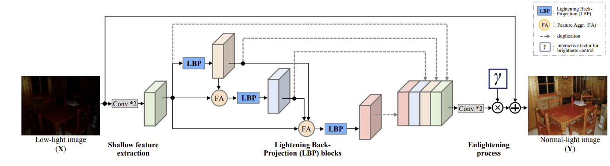
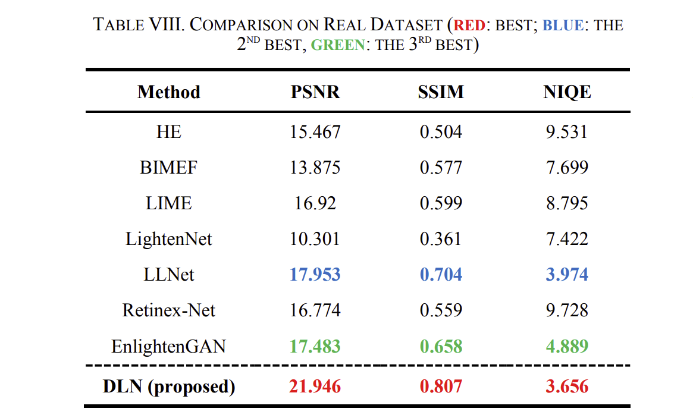
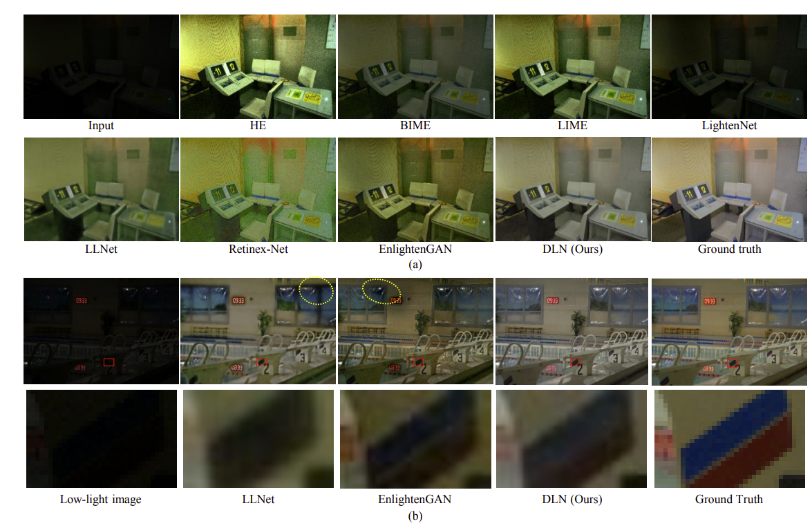

# DLN (Lighting Network for Low-Light Image Enhancement)
By Li-Wen Wang, Zhi-Song Liu, Wan-Chi Siu, and Daniel P. K. Lun

This repo provides simple testing codes, pretrained models and the network strategy demo.

We propose a single image low-light enhancement method based on back-projection theory and attention mechanism. 
to achieve good enhancing performance.

## BibTex
```
@ARTICLE{DLN2020,
  author={Li-Wen Wang and Zhi-Song Liu and Wan-Chi Siu and Daniel P.K. Lun},
  journal={IEEE Transactions on Image Processing}, 
  title={Lightening Network for Low-light Image Enhancement}, 
  year={2020},
  doi={10.1109/TIP.2020.3008396},
}
```
## Complete Architecture
The complete architecture of Deep Lighten Network (DLN) is shown as follows,
The rectangles and cubes denote the operations and feature maps respectively.


#Implementation

## Prerequisites
- Python 3.5
- NVIDIA GPU + CUDA
- [optional] [sacred+ mongodb (experiment control)](https://pypi.org/project/sacred/) 

## Getting Started
### Installation
- Install PyTorch and dependencies from http://pytorch.org
- Install python libraries:
```bash
pip install pillow, opencv-python, scikit-image, sacred, pymongo
```
- Clone this repo


### Testing
- A few example test images are included in the `./test_img` folder.
- Please download trained model
  - Pretrained (trained at voc syntesised dataset that is more general) model from [here](https://connectpolyu-my.sharepoint.com/:u:/g/personal/18048204r_connect_polyu_hk/EcIHFWTYdTdCq4iQ8PmtlpgBi_FYjgxmpJutr_MEp4jXFw?e=9Z73yy) (OneDrive link)
  - Fine-tuned at LOL dataset (towards real low-light image enhancement) from [here](https://connectpolyu-my.sharepoint.com/:u:/g/personal/18048204r_connect_polyu_hk/EbxM3kQKqgpHnxLZD9Kay7QBVN3fkMwMhfxModUUCFyFYg?e=9aSXH1https://connectpolyu-my.sharepoint.com/:u:/g/personal/18048204r_connect_polyu_hk/EbxM3kQKqgpHnxLZD9Kay7QBVN3fkMwMhfxModUUCFyFYg?e=9aSXH1) (OneDrive link)
  - Put them under `./models/`
- Test the model by:
```bash
python test.py --modelfile models/DLN_pretrained.pth

# or if the task towards real low-light image enhancement 
python test.py --modelfile models/DLN_finetune_LOL.pth
```
The test results will be saved to the folder: `./output`.


### Dataset
- Download the VOC2007 dataset and put it to "datasets/VOC2007/".
- Download the LOL dataset and put it to "datasets/LOL".

### Training
It needs to manually switch the training dataset: 
1) first, train from the synthesized dataset, 
2) then, load the pretrained model and train from the real dataset
```bash
python train.py 
```

### Quantitative Comparison
We tested the proposed method on the LOL real dataset
for evaluation. We have achieve better performance.

### Visual Comparison
At LOL dataset:
